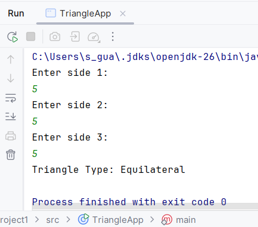
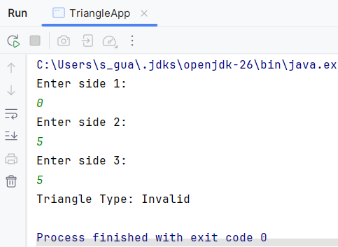
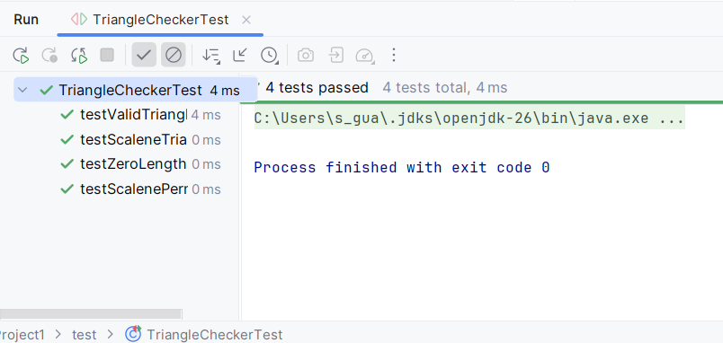

# Project 1 – Unit Testing with Java

| | |
|---|---|
| **Student Name** | Shawn Wilkinson |
| **Course** | MSSE 640 |
| **Assignment** | Project 1 – Unit Testing |
| **Language** | Java |
| **Testing Framework** | JUnit 4 |

---

## Overview

A triangle classification application written in Java. Given three integer side lengths, `TriangleChecker` returns the triangle type (`Equilateral`, `Isosceles`, `Scalene`) or `Invalid` if the sides do not form a valid triangle.

---

## Project Structure

```
src/
  TriangleApp.java          ← main entry point
  TriangleChecker.java      ← classification logic
test/
  TriangleCheckerTest.java  ← JUnit unit tests
lib/
  junit-4.13.2.jar
  hamcrest-core-1.3.jar
screenshots/
  program-run-valid.png
  program-run-invalid.png
  unit-test-passing.png
```

---

## Running the Program

```bash
javac -cp lib/junit-4.13.2.jar src/TriangleChecker.java src/TriangleApp.java
java -cp src TriangleApp
```

---

## Running Unit Tests

```bash
javac -cp lib/junit-4.13.2.jar:src test/TriangleCheckerTest.java -d out/
java -cp lib/junit-4.13.2.jar:lib/hamcrest-core-1.3.jar:src:out org.junit.runner.JUnitCore TriangleCheckerTest
```

---

## Screenshots

**Valid Triangle Run:**



**Invalid Triangle Run:**



**Unit Tests Passing:**


