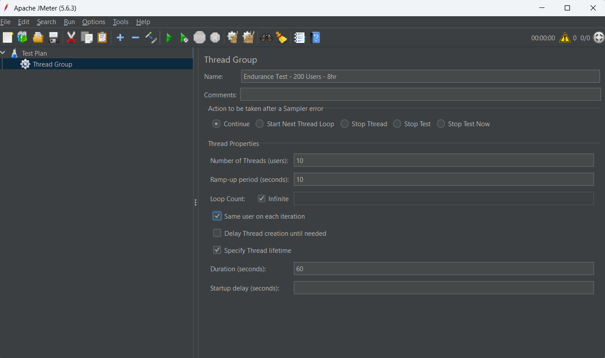
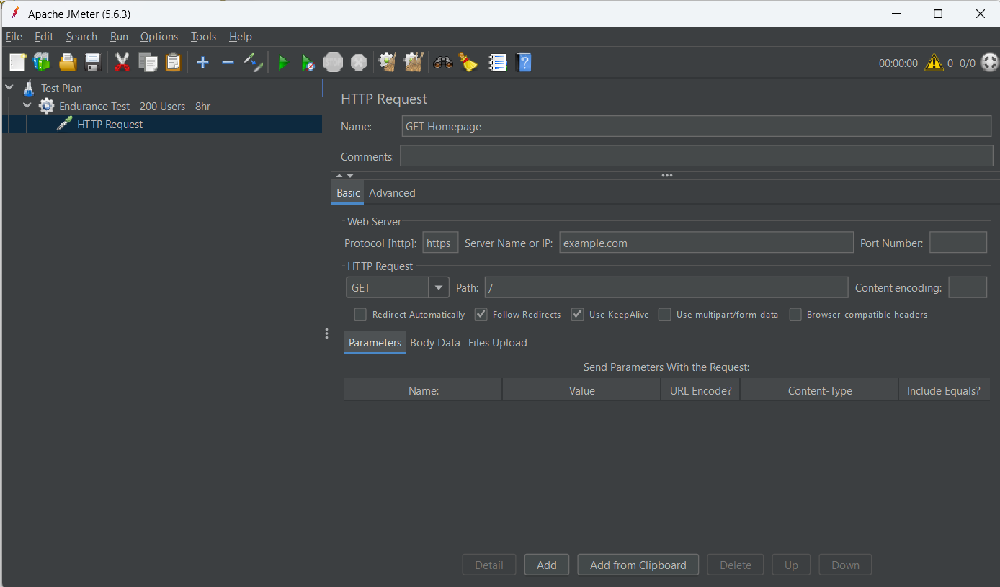
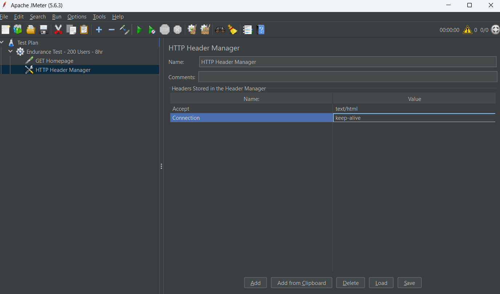
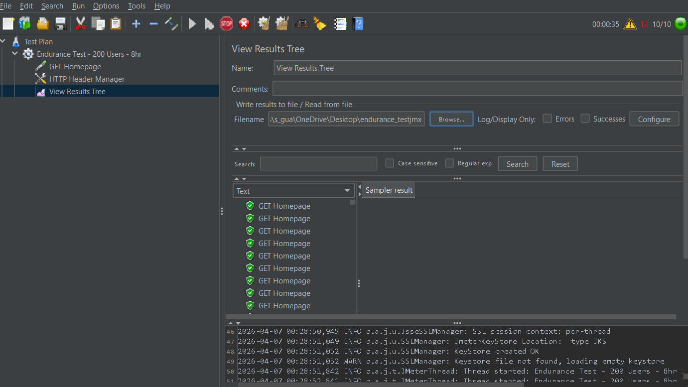
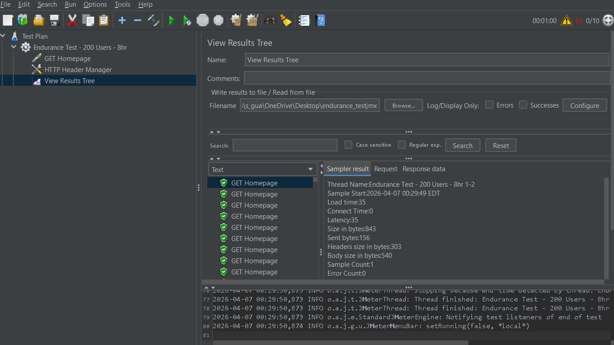
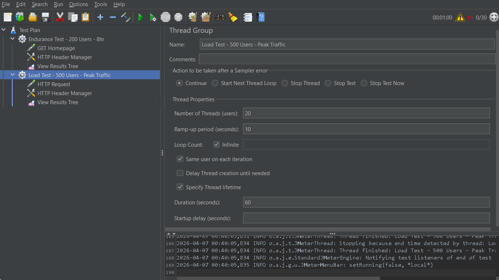
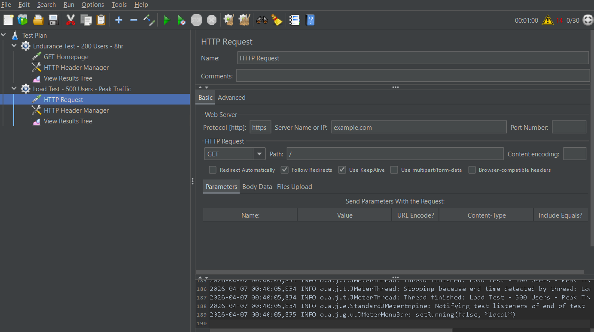
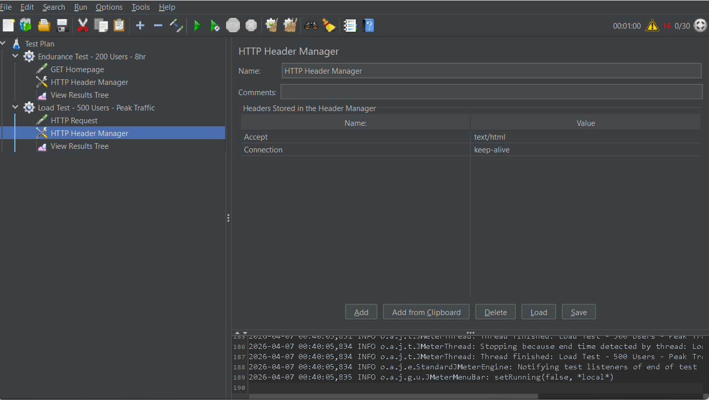
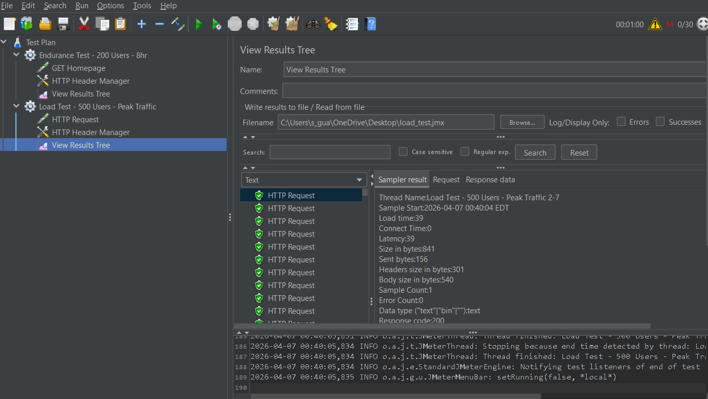
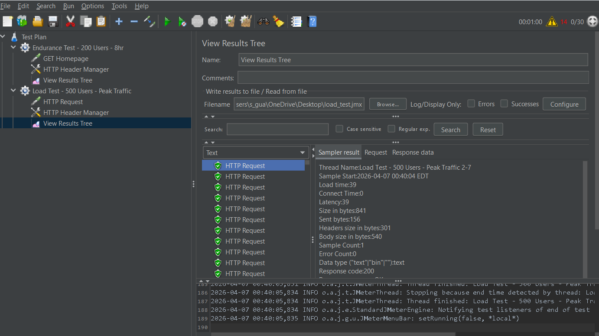

# Project 3: Performance Testing with JMeter

**Course:** Software Testing  
**Revised:** March 31, 2026  

---

## Table of Contents

1. [Introduction](#introduction)
2. [Part 1: Research on Performance Testing and JMeter](#part-1-research-on-performance-testing-and-jmeter)
   - [Types of Performance Tests](#types-of-performance-tests)
   - [JMeter Components](#jmeter-components)
   - [Application Performance Index (Apdex)](#application-performance-index-apdex)
3. [Part 2: JMeter Demo](#part-2-jmeter-demo)
   - [Endurance Test](#endurance-test-configuration)
   - [Load Test](#load-test-configuration)
4. [Extra Credit: Linux Performance Commands](#extra-credit-linux-performance-commands)
5. [Conclusion and Recommendations](#conclusion-and-recommendations)

---

## Introduction

Performance testing is a critical discipline in software quality assurance. While functional testing verifies that an application does the *right thing*, performance testing verifies that it does so *fast enough* and *reliably enough* under real-world conditions. Without performance testing, applications that pass all functional tests can still fail catastrophically in production when subjected to actual user traffic.

This project explores three foundational categories of performance testing — Load, Endurance, and Stress/Spike — and demonstrates how Apache JMeter, a widely adopted open-source performance testing tool, can be used to design, execute, and analyze each type of test. JMeter provides a rich set of components (Thread Groups, HTTP Request Samplers, Config Elements, and Listeners) that together model realistic user behavior against a target application.

The deliverable covers both the theoretical background of performance testing concepts and a hands-on walkthrough of building and running tests in JMeter against a deployed web application.

---

## Part 1: Research on Performance Testing and JMeter

### Types of Performance Tests

#### 1. Load Testing

**Definition:** Load testing verifies that a system behaves correctly and meets performance targets under an *expected*, predefined number of concurrent users. The goal is to validate that the system can sustain normal production traffic without degradation.

**Key characteristics:**
- Thread count ramps up gradually to a target level and holds there for a defined duration.
- Metrics of interest: response time, throughput (requests/sec), and error rate at the target load.
- Pass/fail criteria are established before the test (e.g., "95th-percentile response time must be ≤ 2 seconds at 500 concurrent users").

**Load Test Thread Profile (Time vs. Number of Threads):**

```
Threads
  ^
500|          ___________________________
   |         /                           \
250|        /                             \
   |       /                               \
  0|______/                                 \____
   +---------------------------------------------> Time
   0     5min     10min     20min     25min   30min

  [Ramp-Up] [---------- Steady State ----------] [Ramp-Down]
```

*The thread count ramps to the target (500 users), holds steady to collect stable metrics, then ramps down cleanly.*

---

#### 2. Endurance Testing

**Definition:** Endurance testing (also called *soak testing*) runs the system at a sustained load level for an extended period — hours or even days — to uncover issues that only manifest over time, such as memory leaks, connection pool exhaustion, or gradual disk consumption.

**Key characteristics:**
- Thread count is held constant at a moderate-to-high level for a long duration.
- Target: detect degradation trends (e.g., response times increasing by 20% after 4 hours) that would be invisible in a short load test.
- Common findings: memory leaks, unclosed database connections, log file growth consuming disk space, thread pool saturation.

**Endurance Test Thread Profile (Time vs. Number of Threads):**

```
Threads
  ^
300|     ________________________________________________
   |    /                                                \
150|   /                                                  \
   |  /                                                    \
  0|_/                                                      \__
   +-----------------------------------------------------------> Time
   0   10min       2hr        4hr        6hr        8hr    8hr10min

  [Ramp] [-------------------- Sustained Load -------------------] [Down]
```

*The thread count ramps to a steady level and remains there for many hours to reveal slow degradation.*

---

#### 3. Stress / Spike Testing

**Definition:** Stress and spike testing push the system *beyond* its expected capacity to find its breaking point and observe how it recovers.

- **Stress testing** incrementally increases load past the design limit until the system fails, identifying the maximum throughput and failure mode.
- **Spike testing** introduces a sudden, dramatic surge in users (a "spike") then drops back, testing the system's ability to absorb sudden traffic bursts and recover gracefully.

**Key characteristics:**
- Thread count deliberately exceeds normal operating parameters.
- Reveals failure modes: errors, timeouts, cascading failures, and whether recovery is clean or requires a restart.
- Common findings: thread pool deadlock, out-of-memory errors, database connection exhaustion, load balancer misconfiguration.

**Stress / Spike Test Thread Profile (Time vs. Number of Threads):**

```
Threads
  ^
1000|                 ___
    |                /   \
 500|     __________/     \__________
    |    /                            \       _____
 250|   /                              \     /     \
    |  /                                \   /       \
   0|_/                                  \_/         \___
    +---------------------------------------------------> Time
    0   5min  10min  15min  20min  25min  30min  35min  40min

         [Stress Ramp-Up & Hold]  [Spike]   [Recovery Check]
```

*Load is ramped past the target ceiling (stress), with an additional sudden spike inserted mid-test to simulate unexpected traffic bursts.*

---

### JMeter Components

Apache JMeter is structured around a test plan tree. The core components relevant to this project are:

---

#### Thread Groups

A **Thread Group** is the entry point for every JMeter test. It defines the virtual user population that will execute the test.

**Key settings:**
| Setting | Description |
|---|---|
| Number of Threads (users) | Total virtual users to simulate |
| Ramp-Up Period (seconds) | Time to reach full thread count from 0 |
| Loop Count | How many times each thread runs through the sampler(s) |
| Duration (seconds) | Alternative to Loop Count — run for a fixed time window |
| Scheduler | Enable to set start/end times |

**How to add:** Right-click the Test Plan → Add → Threads (Users) → Thread Group.


*Thread Group configured for the Endurance Test — threads, ramp-up, and duration settings with "Specify Thread lifetime" enabled.*

Thread Groups can be named to reflect their test type (e.g., "Endurance Test - 200 Users - 8hr" or "Spike Test - 1000 Users - 30s Burst"), making the test plan self-documenting.

---

#### HTTP Request Sampler

The **HTTP Request Sampler** is the core action in web performance testing. It defines a single HTTP call that each virtual user will make.

**Key settings:**
| Setting | Description |
|---|---|
| Protocol | `http` or `https` |
| Server Name or IP | Target host (e.g., `example.com`) |
| Port Number | e.g., `443` for HTTPS |
| HTTP Method | `GET`, `POST`, `PUT`, `DELETE`, etc. |
| Path | URL path (e.g., `/api/v1/users`) |
| Parameters / Body | Request payload for POST/PUT |

**How to add:** Right-click the Thread Group → Add → Sampler → HTTP Request.


*HTTP Request Sampler named "GET Homepage" — Protocol: https, Server: example.com, Method: GET, Path: /*

Multiple HTTP Request Samplers can be chained inside a Thread Group to simulate realistic user journeys (e.g., login → browse → add to cart → checkout).

---

#### Config Elements

**Config Elements** define shared configuration that applies to all samplers within their scope. They avoid repetition across individual samplers.

Common config elements:

| Config Element | Purpose |
|---|---|
| **HTTP Header Manager** | Adds HTTP headers (e.g., `Authorization`, `Content-Type`, `Accept`) to every request in scope |
| **HTTP Cookie Manager** | Manages cookies automatically across requests, simulating a real browser session |
| **HTTP Request Defaults** | Sets default server/port/protocol so individual samplers only specify the path |
| **CSV Data Set Config** | Reads test data (e.g., usernames, passwords) from a CSV file to parameterize requests |
| **User Defined Variables** | Defines reusable variables (e.g., `${BASE_URL}`) across the test plan |

**How to add the HTTP Header Manager:** Right-click Thread Group → Add → Config Element → HTTP Header Manager.


*HTTP Header Manager added under the Thread Group as a Config Element, with Accept and Connection headers defined.*

Config Elements are scoped to their parent node — a Header Manager placed inside a Thread Group applies to all samplers in that group; one placed at the Test Plan level applies globally.

---

#### Listeners

**Listeners** collect, display, and record the results of test execution. They are attached to a Thread Group (or the Test Plan) and capture sampler output in real time.

Common listeners:

| Listener | Purpose |
|---|---|
| **View Results Tree** | Shows each individual request and response (headers, body, status). Essential for debugging. |
| **Summary Report** | Aggregate statistics per sampler: min/max/avg response time, throughput, error %. |
| **Aggregate Report** | Similar to Summary Report with percentile columns (90th, 95th, 99th). |
| **Response Time Graph** | Plots response time over the test duration — shows trends and degradation. |
| **Active Threads Over Time** | Plots the live thread count, useful for validating ramp-up behavior. |
| **jp@gc - Transactions per Second** | (Plugin) Plots TPS over time — key throughput metric. |

**How to add:** Right-click Thread Group → Add → Listener → View Results Tree.


*View Results Tree showing all 10 threads active (10/10 top-right) with green checkmarks on every GET Homepage request during the Endurance Test.*

> **Note:** Disable GUI listeners during large-scale tests — they consume significant memory and CPU. Write results to a `.jtl` file instead, then analyze offline.

---

### Application Performance Index (Apdex)

**Apdex** (Application Performance Index) is an open industry standard that converts raw response time measurements into a single score between **0** and **1** representing user satisfaction.

#### How Apdex Works

Apdex classifies each transaction into one of three buckets based on a threshold value **T** (typically set by the team to reflect acceptable response time, e.g., T = 500ms):

| Category | Condition | User Experience |
|---|---|---|
| **Satisfied** | Response time ≤ T | User is fully satisfied |
| **Tolerating** | T < Response time ≤ 4T | User notices the delay but tolerates it |
| **Frustrated** | Response time > 4T, or error | User is frustrated or the request failed |

#### Apdex Formula

```
Apdex = (Satisfied + (Tolerating / 2)) / Total Samples
```

#### Score Interpretation

| Apdex Score | Rating | Meaning |
|---|---|---|
| 1.00 | Excellent | All users satisfied |
| 0.94 – 0.99 | Good | Nearly all users satisfied |
| 0.85 – 0.93 | Fair | Noticeable dissatisfaction |
| 0.70 – 0.84 | Poor | Many users frustrated |
| < 0.70 | Unacceptable | Most users frustrated |

#### Apdex in JMeter

JMeter's **HTML Dashboard Report** (`jmeter -n -t testplan.jmx -l results.jtl -e -o ./report`) automatically calculates and displays Apdex scores per transaction. The T value is configurable in `user.properties`:

```properties
jmeter.reportgenerator.apdex_satisfied_threshold=500
jmeter.reportgenerator.apdex_tolerated_threshold=1500
```

Apdex is preferred over raw average response time because averages mask outliers — a system with average 300ms but 5% of requests timing out at 30s would still show a poor Apdex score, accurately reflecting real user experience.

---

## Part 2: JMeter Demo

### Test Target

Both tests below target a deployed web application. All samplers use HTTPS GET requests against the application's homepage and a REST endpoint.

---

### Endurance Test Configuration

**Test Goal:** Verify the application sustains acceptable performance at 200 concurrent users over 8 hours, with no memory leaks or connection pool degradation.

#### Step 1: Create the Thread Group

1. Open JMeter → File → New → Test Plan
2. Right-click Test Plan → Add → Threads (Users) → Thread Group
3. Rename to: `Endurance Test - 200 Users - 8hr`
4. Configure:
   - Number of Threads: `200`
   - Ramp-Up Period: `120` (seconds — 2 minutes to reach full load)
   - Loop Count: Check **Infinite**
   - Duration: `28800` (seconds = 8 hours)
   - Scheduler: Enabled


*Thread Group named "Endurance Test - 200 Users - 8hr" with thread count, ramp-up period, and duration configured.*

#### Step 2: Create the HTTP Request Sampler

1. Right-click Thread Group → Add → Sampler → HTTP Request
2. Rename to: `GET Homepage`
3. Configure:
   - Protocol: `https`
   - Server Name: `your-app-domain.com`
   - Port: `443`
   - HTTP Method: `GET`
   - Path: `/`


*HTTP Request Sampler "GET Homepage" configured for HTTPS GET to example.com/*

#### Step 3: Add HTTP Header Manager

1. Right-click Thread Group → Add → Config Element → HTTP Header Manager
2. Add the following headers:

| Name | Value |
|---|---|
| `Accept` | `text/html,application/xhtml+xml` |
| `Accept-Language` | `en-US,en;q=0.9` |
| `Connection` | `keep-alive` |


*HTTP Header Manager under the Endurance Test Thread Group with Accept and Connection headers.*

#### Step 4: Add View Results Tree Listener

1. Right-click Thread Group → Add → Listener → View Results Tree
2. In the **Write results to file** field, enter: `endurance_results.jtl`
3. Also add: Add → Listener → Response Time Graph


*View Results Tree showing successful GET Homepage requests (green checkmarks) with all threads running during the Endurance Test.*


*Response body of a sampled GET Homepage request showing the HTTP 200 response content.*

---

### Load Test Configuration

**Test Goal:** Verify the application handles peak expected traffic (500 concurrent users) and meets the defined SLA: 95th-percentile response time ≤ 2 seconds, error rate < 1%.

#### Step 1: Create the Thread Group

1. Right-click Test Plan → Add → Threads (Users) → Thread Group
2. Rename to: `Load Test - 500 Users - Peak Traffic`
3. Configure:
   - Number of Threads: `500`
   - Ramp-Up Period: `300` (5 minutes)
   - Loop Count: Check **Infinite**
   - Duration: `1800` (30 minutes steady state)
   - Scheduler: Enabled


*Thread Group named "Load Test - 500 Users - Peak Traffic" with thread count, ramp-up period, and duration configured.*

#### Step 2: Create the HTTP Request Sampler

1. Right-click Thread Group → Add → Sampler → HTTP Request
2. Rename to: `GET API Users`
3. Configure:
   - Protocol: `https`
   - Server Name: `your-app-domain.com`
   - Port: `443`
   - HTTP Method: `GET`
   - Path: `/api/v1/users`


*HTTP Request Sampler configured for HTTPS GET to the target server.*

#### Step 3: Add HTTP Header Manager

1. Right-click Thread Group → Add → Config Element → HTTP Header Manager
2. Add the following headers:

| Name | Value |
|---|---|
| `Accept` | `application/json` |
| `Content-Type` | `application/json` |
| `Authorization` | `Bearer <your_token>` |


*HTTP Header Manager under the Load Test Thread Group with Accept and Content-Type headers.*

#### Step 4: Add Listeners

1. Right-click Thread Group → Add → Listener → View Results Tree
2. Right-click Thread Group → Add → Listener → Aggregate Report
3. Configure Aggregate Report to write to: `load_results.jtl`


*View Results Tree showing successful requests during the Load Test with green checkmarks.*


*Response body of a sampled request during the Load Test showing the HTTP 200 response content.*

---

## Extra Credit: Linux Commands for Performance Testing

The following Linux commands are valuable for evaluating performance on a virtual machine or server during and after JMeter test execution.

### CPU Performance

```bash
# Real-time CPU and memory usage overview
top

# Enhanced interactive process viewer (install with: sudo apt install htop)
htop

# CPU utilization breakdown per core, updated every 1 second
mpstat -P ALL 1

# CPU load averages over 1, 5, and 15 minutes
uptime

# Detailed CPU info (cores, speed, architecture)
lscpu
```

### Memory

```bash
# Show free/used RAM and swap (human-readable)
free -h

# Detailed virtual memory statistics (1-second interval, 10 samples)
vmstat 1 10

# Show top memory-consuming processes
ps aux --sort=-%mem | head -20

# Detailed memory map for a specific process
pmap -x <PID>
```

### Disk I/O

```bash
# Real-time disk I/O statistics per device
iostat -xz 1

# Disk read/write per process
iotop

# Check disk space usage
df -h

# Disk usage of a specific directory
du -sh /var/log/*
```

### Network

```bash
# Real-time network bandwidth per interface (install: sudo apt install iftop)
iftop -i eth0

# Network statistics: connections, listening ports, TCP state
ss -tulnp

# Legacy equivalent of ss
netstat -tulnp

# Packet-level traffic capture on port 443
tcpdump -i eth0 port 443

# Test latency and packet loss to target
ping -c 100 your-app-domain.com

# Measure HTTP response time from command line
curl -o /dev/null -s -w "Connect: %{time_connect}s\nTTFB: %{time_starttransfer}s\nTotal: %{time_total}s\n" https://your-app-domain.com/
```

### Process and System

```bash
# Count open file descriptors (relevant for connection pool leaks)
lsof | wc -l

# Open files for a specific process
lsof -p <PID>

# System calls made by a process (useful for diagnosing slow I/O)
strace -p <PID> -e trace=network

# Kernel performance counters (CPU cycles, cache misses, branch mispredictions)
perf stat -p <PID>

# System-wide performance snapshot (install: sudo apt install sysstat)
sar -u 1 60   # CPU for 60 seconds
sar -r 1 60   # Memory for 60 seconds
sar -n DEV 1 60  # Network for 60 seconds
```

### Practical Monitoring Script During a JMeter Test

```bash
#!/bin/bash
# Run this on the server during a JMeter endurance test to capture a baseline
LOGFILE="perf_$(date +%Y%m%d_%H%M%S).log"
echo "Starting performance capture at $(date)" > $LOGFILE

while true; do
    echo "=== $(date) ===" >> $LOGFILE
    echo "-- CPU/MEM --" >> $LOGFILE
    top -bn1 | head -15 >> $LOGFILE
    echo "-- DISK I/O --" >> $LOGFILE
    iostat -xz 1 1 >> $LOGFILE
    echo "-- NETWORK --" >> $LOGFILE
    ss -s >> $LOGFILE
    echo "-- OPEN FILES --" >> $LOGFILE
    lsof | wc -l >> $LOGFILE
    sleep 60
done
```

---

## Conclusion and Recommendations

### What We Learned

This project reinforced several key insights about performance testing:

1. **Performance testing is distinct from functional testing.** A system can pass every functional test and still fail under realistic load. Performance testing fills this gap by simulating actual user concurrency and sustained traffic patterns.

2. **Test type selection matters.** Load testing confirms the system meets its SLA under expected traffic. Endurance testing uncovers slow-burn issues like memory leaks that only appear over time. Stress/spike testing reveals failure modes and recovery behavior. Each type answers a different question, and a mature test strategy uses all three.

3. **JMeter's component model is composable and powerful.** The separation of Thread Groups (who), Samplers (what), Config Elements (how), and Listeners (observe) makes it straightforward to build and reuse test plans. Naming components clearly (e.g., "Endurance Test - 200 Users - 8hr") makes test plans self-documenting.

4. **Apdex provides a user-centric performance metric.** Raw averages are misleading; Apdex captures the proportion of users who are satisfied, tolerating, or frustrated, giving a single actionable number that correlates directly to user experience.

5. **Server-side monitoring is essential.** JMeter captures the client's view. Combining it with server-side Linux tools (`top`, `iostat`, `ss`, `sar`) provides a complete picture of *where* a bottleneck originates — CPU, memory, disk, or network.

### Recommendations to Improve This Assignment

1. **Provide a shared target application.** Students without deployment experience spend significant time setting up a test target rather than learning JMeter. A shared staging URL (even a simple static site with an API endpoint) would let everyone focus on the testing concepts.

2. **Require a CI/CD-integrated performance test.** Having students run JMeter from the command line (`jmeter -n -t plan.jmx -l results.jtl`) and generate an HTML report teaches the non-GUI workflow used in real CI pipelines (Jenkins, GitHub Actions).

3. **Add a baseline comparison exercise.** Running the same test before and after a configuration change (e.g., enabling HTTP keep-alive, adding a CDN) would demonstrate how performance testing drives measurable improvements.

4. **Include a threshold-based pass/fail requirement.** Requiring students to define Apdex or percentile thresholds — and write a brief analysis of whether the application passed — connects testing to real acceptance criteria rather than just collecting data.

5. **Expand the Linux section.** The extra credit commands deserve more prominence. Understanding server-side metrics is essential for interpreting JMeter results and diagnosing root causes of performance degradation.
