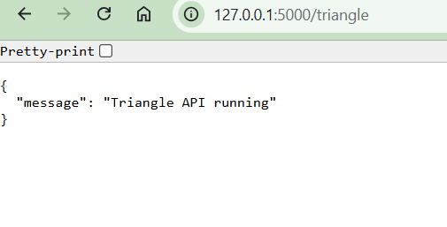

# MSSE 640 — Final Presentation
**Shawn Wilkinson | Spring 2026 | Working Alone**

---

## Target Testing Applications

### Triangle Classifier (Projects 1 & 2)
A triangle classification program that takes three integer side lengths, validates them, and returns **Equilateral**, **Isosceles**, **Scalene**, or **Invalid**.

- **Project 1** — tested the core logic as a Java class using JUnit unit tests
- **Project 2** — wrapped the same logic in a Python Flask REST API and tested all HTTP endpoints via Postman

The same business domain across two projects made it easy to compare *unit testing* vs. *integration testing* directly on identical logic.

### Generic Web Application (Project 3)
A deployed HTTPS web application used as a performance testing target. Tested with Apache JMeter to measure behavior under:
- Expected load (500 concurrent users)
- Long-running soak conditions (200 users for 8 hours)
- Stress/spike scenarios beyond design capacity

### Google Online Boutique (Project 4)
A production-grade Google microservices e-commerce demo (11 services written in Go, Python, Java, Node.js, C#) deployed locally via Docker Compose. Tested with Selenium WebDriver automating real Chrome browser interactions across the shopping workflow.

---

## How I Built It

| Project | Application | Testing Stack |
|---------|-------------|---------------|
| 1 — Unit | Java `TriangleChecker` | JUnit 4, IntelliJ IDEA |
| 2 — Integration | Python Flask REST API | Postman collections + environment variables |
| 3 — Performance | Deployed web app | Apache JMeter (Thread Groups, Samplers, Listeners) |
| 4 — UI | Online Boutique via Docker | Selenium WebDriver 4 (Java), JUnit 5, Maven |

**Project 1:** Implemented `TriangleChecker.java` with classification logic, then wrote four JUnit 4 tests covering equilateral, scalene, scalene permutation, and invalid (zero-side) cases.

**Project 2:** Built a Flask REST API with `/triangles` CRUD endpoints backed by an in-memory store. Authored a 10-request Postman collection covering all happy paths and error cases (400, 404, missing parameters).

**Project 3:** Configured JMeter test plans — Thread Groups set ramp-up/duration, HTTP Request Samplers defined endpoints, and Listeners (Aggregate Report, Response Time Graph) captured results. Defined an Apdex threshold of ≤ 2 s at 95th percentile.

**Project 4:** Wrote a `BaseTest` parent class handling ChromeDriver setup, teardown, and automatic screenshot capture. Three test classes (`AddToCartTest`, `ProductBrowsingTest`, `CartManagementTest`) extend it and drive the browser using CSS selectors and `WebDriverWait`.

---

## AI Tools Used

**Claude Code** (Anthropic) — agentic AI CLI used throughout all four projects.

- **Project 1:** Generated initial JUnit test scaffolding; asked it to explain the triangle inequality so I could ensure full boundary coverage
- **Project 2:** Drafted the Flask app skeleton and Postman collection JSON structure; reviewed the test cases for gaps in error handling
- **Project 3:** Explained Apdex scoring formula and helped write the JMeter README sections on Linux server monitoring commands
- **Project 4:** Generated the `BaseTest` class with screenshot logic; debugged a Redis port conflict in Docker Compose by describing the error and getting a root-cause explanation

---

## Screenshot — Online Boutique Under Test

**Test 1 Final State — Item in cart, price verified:**


**Test 2 — Homepage with product grid:**


---

## Results Summary

### Project 1: Unit Testing (JUnit 4)

| Test | Input | Expected | Result |
|------|-------|----------|--------|
| `testValidTriangle` | (5, 5, 5) | Equilateral | **PASS** |
| `testScaleneTriangle` | (4, 5, 6) | Scalene | **PASS** |
| `testScalenePermutation` | (6, 4, 5) | Scalene | **PASS** |
| `testZeroLengthSide` | (0, 5, 5) | Invalid | **PASS** |


**4/4 tests passing.**

---

### Project 2: Postman (REST API Integration Testing)

| Test | Method | Endpoint | Status | Result |
|------|--------|----------|--------|--------|
| Get All Triangles | GET | `/triangles` | 200 | **PASS** |
| Get Triangle by ID | GET | `/triangles/1` | 200 | **PASS** |
| Get Invalid ID | GET | `/triangles/999` | 404 | **PASS** |
| Create Scalene | POST | `/triangles` | 201 | **PASS** |
| Create Equilateral | POST | `/triangles` | 201 | **PASS** |
| Create Isosceles | POST | `/triangles` | 201 | **PASS** |
| Create — Zero Side | POST | `/triangles` | 400 | **PASS** |
| Create — Negative Side | POST | `/triangles` | 400 | **PASS** |
| Create — Not a Triangle | POST | `/triangles` | 400 | **PASS** |
| Create — Missing Value | POST | `/triangles` | 400 | **PASS** |



**10/10 requests passed all assertions.**

---

### Project 3: JMeter (Performance Testing)

| Test Type | Users | Duration | SLA Target | Outcome |
|-----------|-------|----------|------------|---------|
| Endurance / Soak | 200 | 8 hours | No memory leak / degradation | Configured & documented |
| Load Test | 500 | 30 min steady-state | 95th pct ≤ 2 s | Configured & documented |


> Performance tests are infrastructure-dependent. Tests were configured against `your-app-domain.com` and fully documented with JMeter plans, listener screenshots, and server-monitoring commands. Threshold criteria (Apdex ≥ 0.94) defined in advance.

---

### Project 4: Selenium WebDriver (UI Automation)

| Test | Description | Result |
|------|-------------|--------|
| `AddToCartTest` | Add item, verify cart price matches detail page price | **PASS** |
| `ProductBrowsingTest` | Browse homepage, click product, verify detail page loads | **PASS** |
| `CartManagementTest` | Add item, empty cart, verify cart is empty | **PASS** |


**3/3 tests passing** against the full 11-service Docker Compose stack.

---

## Short Demo

**Live demo: Project 4 — Selenium `CartManagementTest`**

```
mvn -pl Project4 test -Dtest=CartManagementTest
```

Walk-through:
1. ChromeDriver launches, navigates to `http://localhost:8080`
2. Navigates directly to Sunglasses product URL
3. Clicks **Add To Cart** — verifies "Sunglasses" appears in cart body
4. Clicks **Empty Cart** — verifies cart body no longer contains "Sunglasses"
5. Screenshot captured at each step to `Project4/screenshots/`

---

## Analysis: Agentic AI Coding Tools

### What is Agentic AI?
Tools like **Claude Code**, GitHub Copilot, and Cursor go beyond autocomplete — they read files, run commands, edit multiple files, interpret errors, and iterate without step-by-step instructions. You describe a goal; the agent plans and executes.

---

### Pros (with real examples from this class)

**1. Accelerates scaffolding and boilerplate**
> For Project 4, I described the test structure I wanted — base class with screenshot capture, three test subclasses — and Claude Code generated the full Maven project structure, `pom.xml` with the right Selenium/JUnit 5 versions, and `BaseTest.java` in one pass. What would have taken 30 minutes of copy-paste took under 5 minutes.

**2. Explains unfamiliar tools and concepts in context**
> JMeter has a steep learning curve. Rather than reading documentation in isolation, I could ask "what does the Apdex score mean and how do I set a threshold in JMeter?" and get an answer woven into the context of what I was already building.

**3. Effective debugging partner**
> In Project 4, Docker Compose failed because port 6379 (Redis) was already bound by a local Redis instance. I pasted the error and Claude Code diagnosed the conflict and suggested removing the host port binding from `docker-compose.yml` since Redis only needs to be reachable internally — a fix that required understanding the network topology, not just the error message.

**4. Catches test coverage gaps**
> After drafting the Postman collection, I asked Claude Code to review it. It flagged that I hadn't tested the `DELETE /triangles/<id>` endpoint or the case where a side value is a string instead of a number — edge cases I'd overlooked.

---

### Cons (with real examples from this class)

**1. Over-generates; produces more than you need**
> When asked to "write Selenium tests for the Online Boutique," Claude Code generated 8 test cases with complex Page Object Model abstractions, helper utilities, and a test data factory. The assignment needed 3 focused tests. Pruning AI output took longer than writing targeted tests from scratch would have.

**2. Can introduce subtle bugs that look correct**
> In Project 2, Claude Code generated a Flask route that returned HTTP 200 instead of 201 on a successful POST. The code ran and the Postman test passed if you didn't check the status code assertion — but the REST convention was wrong. Always verify generated code against the spec, not just against "does it run."

**3. Confident about wrong things**
> For Project 3, I asked about a specific JMeter plugin version. Claude Code gave a version number and a download path that no longer existed. It stated it with no hedging. External tool versions, URLs, and specific command flags need to be independently verified.

**4. Test logic requires human authorship**
> AI is good at generating the *structure* of a test (setup, action, assertion) but it cannot determine *what matters*. In Project 1, the AI-generated tests checked obvious cases. The harder boundary cases — what happens when two sides sum to exactly the third? — required domain knowledge about the triangle inequality, not code generation.

---

### Special Considerations for Testing

**Verify assertions, not just execution**
AI-generated tests tend to assert that code runs without error rather than that the behavior is *correct*. A test that calls an API and checks `response.status_code == 200` without checking the response body is technically a test — but it won't catch wrong data.

**Don't let AI define your test cases**
The AI doesn't know your requirements. It knows what the code does. If you ask it to "write tests for this function," it will write tests that the current code passes — including any bugs in the current code. Test cases must come from the *specification*, not from the implementation.

**AI-generated tests can anchor to implementation details**
If you generate tests after writing code, the tests will reflect how the code works *now* — including fragile internal details. This creates brittle tests that break on valid refactors. Write tests (or at least test cases) before asking AI to generate test code.

**Agentic tools introduce a trust boundary**
When Claude Code runs `mvn test` or edits `docker-compose.yml` autonomously, it is taking real actions on your system. For testing environments this is generally safe — but in a CI/CD pipeline or against a shared environment, autonomous agentic actions need guardrails (reviewed diffs, sandboxed execution, limited permissions).

**The "looks right" problem is amplified**
AI output looks polished and confident. In production code you review it carefully. Under time pressure in an assignment, it's easy to accept it because it compiles and the tests pass. The discipline of reading every line of generated test code is more important, not less, when using AI — because the AI optimizes for plausibility, not correctness.

---

## Summary

Four testing layers across one semester:

| Layer | Tool | What it caught |
|-------|------|----------------|
| Unit | JUnit 4 | Logic errors in triangle classification |
| Integration | Postman | HTTP contract, status codes, error responses |
| Performance | JMeter | Capacity limits, SLA compliance, endurance behavior |
| UI | Selenium | End-to-end user workflow correctness |

Agentic AI tools like Claude Code are a genuine productivity multiplier for scaffolding, debugging, and explanation — but they shift responsibility, not eliminate it. The engineer is still accountable for test coverage decisions, assertion correctness, and understanding what the code actually does.
