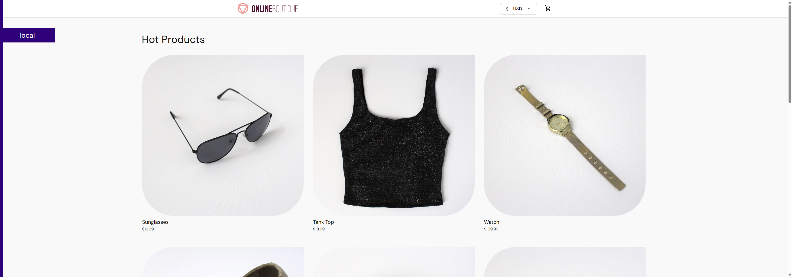
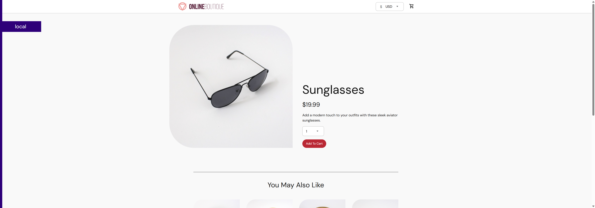
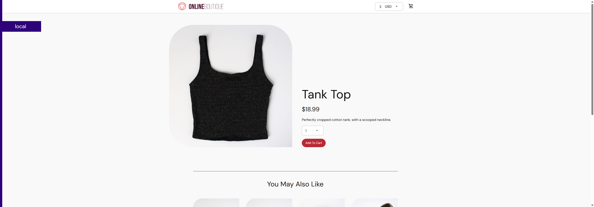
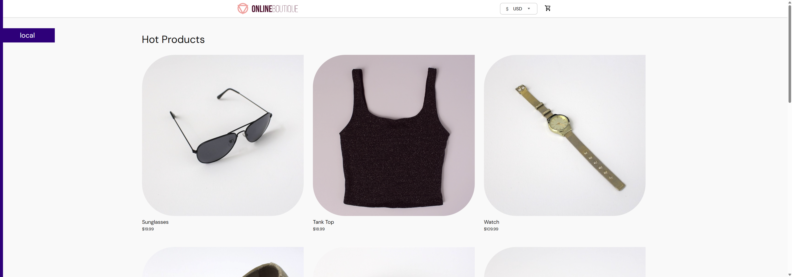
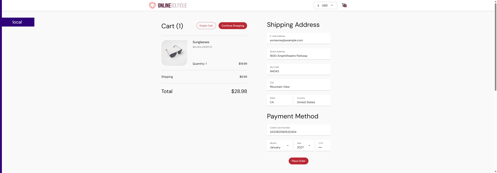
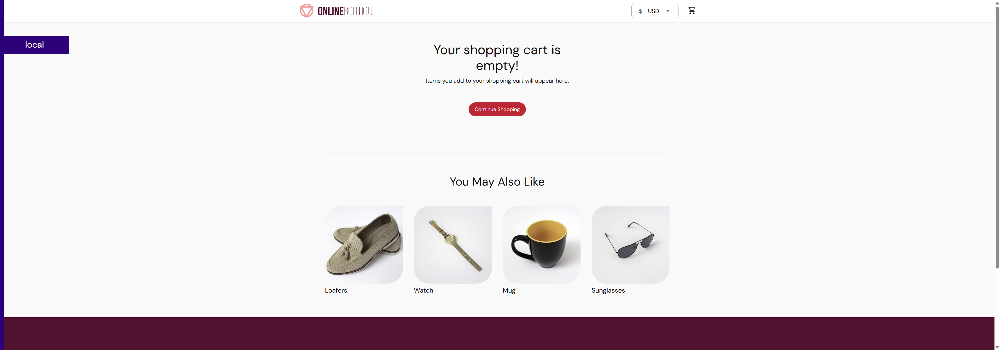

# Project 4: User Testing with Selenium

**Course:** Software Testing  
**Name:** Shawn Wilkinson

**Professor:** Randall Granier

---

## Table of Contents

1. [Introduction](#introduction)
2. [Setup and Prerequisites](#setup-and-prerequisites)
   - [Deploy the Online Boutique](#deploy-the-online-boutique)
   - [Run the Selenium Tests](#run-the-selenium-tests)
3. [Research: What is Selenium?](#research-what-is-selenium)
4. [Part 1: Required Test — Add to Cart and Verify Price](#part-1-required-test--add-to-cart-and-verify-price)
5. [Part 2: Additional Tests](#part-2-additional-tests)
   - [Test 2: Product Browsing](#test-2-product-browsing)
   - [Test 3: Cart Management (Add and Empty)](#test-3-cart-management-add-and-empty)
6. [Test Results and Screenshots](#test-results-and-screenshots)
7. [Conclusion](#conclusion)

---

## Introduction

This project demonstrates automated UI testing using **Selenium WebDriver** against the **Google Online Boutique** — a microservices-based e-commerce demo application deployed locally via Docker Compose.

Rather than using the Selenium IDE browser extension, I chose to write the tests programmatically in **Java** using **Selenium 4** and **JUnit 5**. This approach more closely mirrors how automated testing is done in professional software development: tests are code, version-controlled alongside the project, and executable from the command line or a CI/CD pipeline.

**Technology stack:**
| Tool | Version | Purpose |
|---|---|---|
| Java | 11 | Test implementation language |
| Selenium WebDriver | 4.21.0 | Browser automation framework |
| JUnit 5 | 5.10.2 | Test runner and assertions |
| Maven | 3.x | Build and dependency management |
| Chrome + Selenium Manager | Latest | Browser driver (auto-managed) |
| Docker Compose | v2 | Online Boutique deployment |

**Tests implemented:**
| # | Test Class | Description |
|---|---|---|
| 1 | `AddToCartTest` | Add item to cart and verify price matches (Part 1 required) |
| 2 | `ProductBrowsingTest` | Browse homepage and verify product detail page loads |
| 3 | `CartManagementTest` | Add item to cart then empty the cart |

---

## Setup and Prerequisites

### Deploy the Online Boutique

The Online Boutique is a multi-service application (frontend, cart, checkout, payment, etc.) deployed entirely via Docker Compose — no Kubernetes required.

**Prerequisites:**
- Docker Desktop installed and running
- Ports `8080` free on your machine

**Steps:**

1. Clone or download this project.
2. From the `Project4/` directory, run:

```bash
docker compose up -d
```

3. Wait ~30 seconds for all containers to start, then open:

```
http://localhost:8080
```

You should see the Online Boutique storefront with products listed.

**To stop the app:**

```bash
docker compose down
```

> **Note:** If port `6379` is already in use (e.g., a local Redis instance), the `redis-cart` container will fail to bind. The `docker-compose.yml` in this project removes the host port mapping for Redis since it only needs to be reachable internally by the `cartservice`.

---

### Run the Selenium Tests

**Prerequisites:**
- Java 11+ installed (`java -version`)
- Maven installed (`mvn -version`)
- Google Chrome installed
- Online Boutique running at `http://localhost:8080`

**Run all tests:**

```bash
mvn test
```

Maven will compile the test classes, download dependencies (Selenium, JUnit), and execute all three tests. Selenium Manager automatically downloads and manages the correct ChromeDriver — no manual driver installation needed.

**Screenshots** are saved automatically to `screenshots/` during each test run.

**Expected output:**

```
=== TEST 1: Add To Cart Price Verification ===
Navigated to: http://localhost:8080
Product price on detail page: $19.99
Clicked 'Add To Cart'
RESULT: PASS — Cart page contains expected price [$19.99]

=== TEST 2: Product Browsing ===
Product cards found on homepage: 9
PASS — Catalog contains 9 products
PASS — Detail page loaded with price [$19.99] and Add To Cart button visible
PASS — Homepage reloaded with 9 products after pressing Back

=== TEST 3: Cart Management ===
Opened product page: http://localhost:8080/product/OLJCESPC7Z
Product price: $19.99
Clicked 'Add To Cart' for Sunglasses
PASS — [Sunglasses] is in the cart
Clicked 'Empty Cart'
PASS — Empty cart section is visible: "Your shopping cart is empty!"
```

---

## Research: What is Selenium?

**Selenium** is an open-source framework for automating web browsers. It was originally created by Jason Huggins in 2004 at ThoughtWorks as an internal tool, and has since become the industry standard for browser-based UI testing.

### Core Components

| Component | Description |
|---|---|
| **Selenium WebDriver** | The core API that drives a real browser (Chrome, Firefox, Safari, Edge) programmatically via the browser's native automation protocol. This is what this project uses. |
| **Selenium IDE** | A browser extension (Chrome/Firefox) that records and replays user interactions without writing code. Good for quick tests and learning, but limited for complex logic. |
| **Selenium Grid** | Allows tests to run in parallel across multiple machines and browsers simultaneously — used for large-scale cross-browser testing. |

### How Selenium WebDriver Works

```
Test Code (Java)
      │
      ▼
Selenium WebDriver API
      │
      ▼
Browser Driver (ChromeDriver)   ←── Selenium Manager auto-downloads this
      │
      ▼
Google Chrome (real browser)
      │
      ▼
Web Application (http://localhost:8080)
```

When a test calls `driver.get("http://localhost:8080")`, Selenium sends a command to ChromeDriver via the W3C WebDriver protocol (HTTP). ChromeDriver translates that command into a native Chrome DevTools instruction, which actually navigates the browser. The response travels back up the chain to your test code.

### Developer Tools and CSS Selectors

To write reliable Selenium tests you need to identify HTML elements on the page. Chrome's **Developer Tools** (`F12`) are essential for this:

1. Press `F12` to open DevTools
2. Click the **Inspector cursor** (top-left icon) and hover over any element on the page
3. The HTML source highlights the corresponding element, showing its `id`, `class`, `data-*` attributes, and tag structure

For example, hovering over an "Add To Cart" button in the Online Boutique reveals:

```html
<button type="submit" class="cymbal-button-primary">Add To Cart</button>
```

This CSS selector is then used directly in the test:

```java
driver.findElement(By.cssSelector("button.cymbal-button-primary"))
```

### Why Programmatic Selenium Over Selenium IDE?

| Factor | Selenium IDE | Programmatic (Java + WebDriver) |
|---|---|---|
| Logic and loops | Limited | Full language capabilities |
| Assertions | Basic | Flexible (JUnit, TestNG) |
| Version control | Export only | Native — tests are code |
| CI/CD integration | Manual export | `mvn test` from any pipeline |
| Reusability | Low | High (base classes, utilities) |
| Maintainability | Fragile recordings | Structured, refactorable code |

For this project, the programmatic approach was chosen because it produces tests that are easier to maintain, extend, and run automatically.

---

## Part 1: Required Test — Add to Cart and Verify Price

### User Story

> As a shopper, I want to browse the Online Boutique homepage, select an item, add it to my cart, and confirm that the cart total matches the item's listed price — so I can trust that the checkout process is accurate.

### Test Steps

| Step | Action | Expected Result |
|---|---|---|
| 1 | Navigate to `http://localhost:8080` | Homepage loads with product catalog |
| 2 | Click the first product card | Product detail page loads |
| 3 | Record the price displayed on the product detail page | Price captured (e.g., `$19.99`) |
| 4 | Click "Add To Cart" | Redirected to `/cart` |
| 5 | Check that the cart page contains the recorded price | Page body includes the price text |
| 6 | Print PASS or FAIL | Console output confirms result |

### Implementation

The test is implemented in `src/test/java/boutique/AddToCartTest.java`. Key selectors used:

```java
// First product link on the homepage
By.cssSelector(".hot-product-card a")

// Price on the product detail page
By.cssSelector("p.product-price")

// Add To Cart button
By.cssSelector("button.cymbal-button-primary")
```

After clicking "Add To Cart", the app redirects to `/cart`. The test then reads the full page body text and asserts that it contains the price string captured from the product page — confirming the cart is displaying the correct amount.

### Screenshots

**Step 1 — Homepage with product catalog:**



**Step 2 — Product detail page with price:**



**Step 3 — Cart page after adding item:**


**Final state:**


**Result: PASS**

---

## Part 2: Additional Tests

### Test 2: Product Browsing

#### User Story

> As a shopper, I want to browse the product catalog, click into a product, and verify that the product detail page loads correctly with a name and price displayed — so I know the storefront is functioning before I attempt to buy.

#### Test Steps

| Step | Action | Expected Result |
|---|---|---|
| 1 | Navigate to the homepage | Page loads |
| 2 | Count product cards on the homepage | More than 1 product is displayed |
| 3 | Click the second product card | Product detail page loads |
| 4 | Verify a price is shown (contains `$`) | Price element is visible and non-empty |
| 5 | Verify the "Add To Cart" button is visible | Button is displayed on the page |
| 6 | Click the browser Back button | Homepage reloads |
| 7 | Verify products are still visible after navigating back | Product cards are present |

#### Key Assertions

```java
// At least one product exists
assertTrue(productCards.size() > 1, "Expected more than one product");

// Price is a non-empty dollar amount
assertTrue(priceText.contains("$"), "Price should contain a dollar sign");

// Add To Cart button is visible
assertTrue(addToCartBtn.isDisplayed(), "Add To Cart button should be visible");

// Homepage still works after pressing Back
assertTrue(cardsAfterBack.size() > 0, "Homepage should reload after Back");
```

#### Screenshots

**Step 1 — Homepage with multiple product cards:**


**Step 2 — Product detail page with price and Add To Cart button:**



**Step 3 — Homepage after pressing Back:**


**Final state:**



**Result: PASS**

---

### Test 3: Cart Management (Add and Empty)

#### User Story

> As a shopper, I want to add an item to my cart and then remove it — so that I can change my mind before checkout without leaving unwanted items in my cart.

#### Test Steps

| Step | Action | Expected Result |
|---|---|---|
| 1 | Navigate directly to a known product URL | Product detail page loads with price visible |
| 2 | Click "Add To Cart" | Redirected to `/cart` |
| 3 | Verify the cart page contains the product name ("Sunglasses") | Product name appears in cart |
| 4 | Click "Empty Cart" | App redirects to homepage `/` |
| 5 | Navigate back to `/cart` | Cart is now empty |
| 6 | Verify the empty cart section is visible | `"Your shopping cart is empty!"` message shown |

#### Why a Direct Product URL?

Rather than relying on the homepage to locate a specific product (which is fragile if product order changes), this test navigates directly to a known product URL:

```
http://localhost:8080/product/OLJCESPC7Z  →  Sunglasses
```

This makes the test deterministic — it always tests the same product and can assert by product name.

#### Key Selectors

```java
// Empty Cart button
By.cssSelector("button.cart-summary-empty-cart-button")

// Empty cart confirmation section
By.cssSelector("section.empty-cart-section")
```

#### Screenshots

**Step 1 — Cart page with Sunglasses added:**



**Step 2 — Cart after clicking "Empty Cart":**



**Final state:**


**Result: PASS**

---

## Test Results and Screenshots

All three tests passed on the locally deployed Online Boutique instance.

| Test | Class | Result |
|---|---|---|
| Add item to cart and verify price matches | `AddToCartTest` | PASS |
| Homepage shows products and product detail page loads correctly | `ProductBrowsingTest` | PASS |
| Add item to cart then empty the cart | `CartManagementTest` | PASS |

Screenshots for each test are saved automatically to the `screenshots/` directory during every test run. Each screenshot is named using the test display name and a step label (e.g., `Add_item_to_cart_and_verify_price_matches__03_cart_page.png`), making it easy to trace exactly what the browser showed at each point.

---

## Conclusion

This project demonstrated how to use Selenium WebDriver programmatically to automate UI tests against a real microservices web application. Key takeaways:

1. **Programmatic Selenium scales better than IDE recordings.** Writing tests in Java gave full control over test logic, assertions, and screenshot capture. The `BaseTest` base class handles setup, teardown, and screenshots automatically so individual test classes stay focused on the user scenario.

2. **CSS selectors are the most stable locators.** The Online Boutique uses consistent class names (`.hot-product-card`, `p.product-price`, `button.cymbal-button-primary`), making CSS selectors reliable. XPath or text-based selectors would be more brittle.

3. **Explicit waits are essential.** Because the app runs in Docker and services communicate over a network, page loads are not instantaneous. Using `WebDriverWait` with `ExpectedConditions` ensures the test waits for elements to be visible or clickable rather than sleeping for a fixed duration.

4. **Docker Compose made deployment easy.** Deploying the full 10-service Online Boutique with a single `docker compose up -d` command eliminated environment setup friction and made the tests reproducible on any machine with Docker installed.
