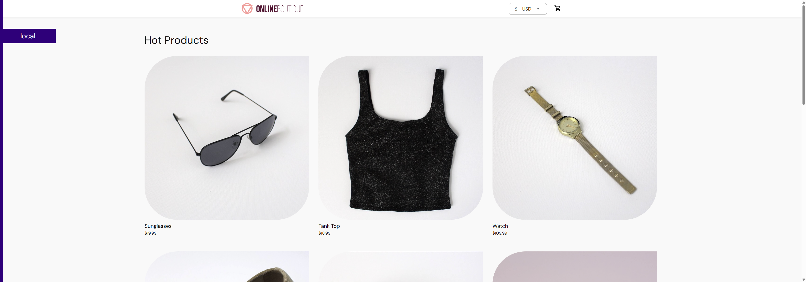
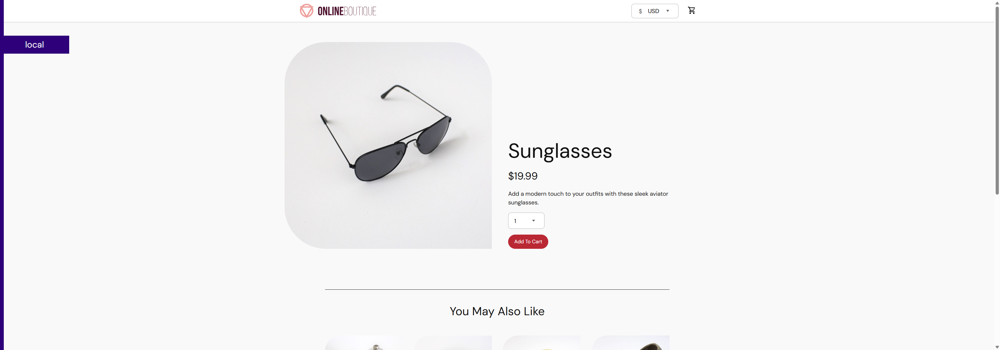
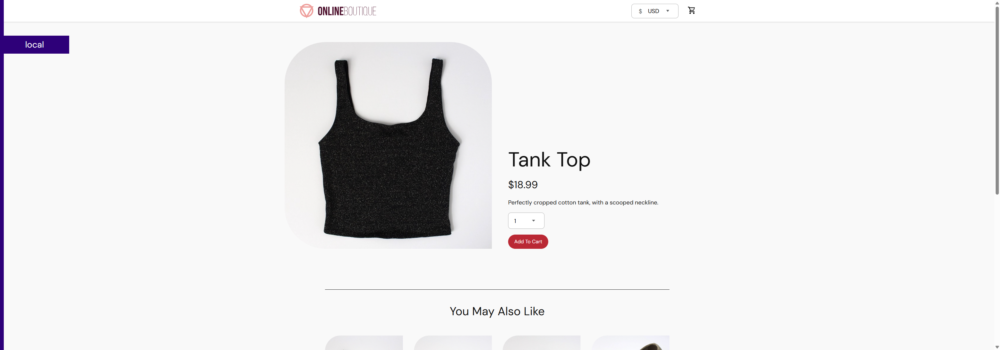
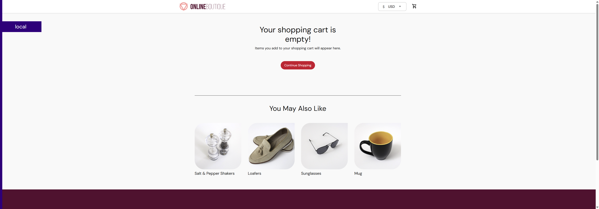

# Project 4: Selenium User Testing

## Introduction

This project automates user acceptance tests against the **Google Online Boutique** demo e-commerce application using **Java**, **Selenium WebDriver 4**, and **JUnit 5** run through **Maven**.

### Setup Overview

| Component | Version / Tool |
|---|---|
| Language | Java 11+ |
| Test Framework | JUnit 5 (Jupiter) |
| Browser Automation | Selenium WebDriver 4.21 |
| Build Tool | Apache Maven |
| App Under Test | Google Online Boutique (Docker) |
| Browser | Google Chrome |

Selenium 4 ships with **Selenium Manager**, which automatically downloads the correct version of ChromeDriver. No manual driver setup is required.

---

## Part 1: Setup

### 1. Prerequisites

- [Java 11+](https://adoptium.net/) installed and on your PATH
- [Apache Maven](https://maven.apache.org/download.cgi) installed
- [Docker Desktop](https://www.docker.com/products/docker-desktop/) installed and running
- [Google Chrome](https://www.google.com/chrome/) installed

Verify your environment:

```bash
java -version
mvn -version
docker --version
```

### 2. Deploy the Online Boutique with Docker

From the `project4/` directory:

```bash
docker compose up -d
```

Wait about 60–90 seconds for all containers to start, then open your browser to:

```
http://localhost:8080
```

You should see the Online Boutique storefront with products listed.

### 3. Run the Selenium Tests

From the `project4/` directory:

```bash
# Run all tests
mvn test

# Run a specific test class
mvn test -Dtest=AddToCartTest
mvn test -Dtest=ProductBrowsingTest
mvn test -Dtest=CartManagementTest
```

Test results are printed to the console and saved in `target/surefire-reports/`.  
Screenshots are automatically saved to `screenshots/` after each test step.

---

## Part 2: Test Cases

### Test 1 — Add to Cart and Verify Price (`AddToCartTest.java`)

**User Story:**
As a shopper, I want to browse the Online Boutique homepage, select an item, add it to my cart, and confirm that the cart total matches the item's listed price so I can trust the checkout process is accurate.

**Test Steps:**

1. Open `http://localhost:8080`
2. Click the first product in the catalog
3. Record the price shown on the product detail page
4. Click **Add To Cart**
5. On the cart page, compare the displayed price against the recorded price
6. Print `PASS` or `FAIL` with the actual vs. expected values

**Pass Criteria:** The price shown in the cart matches the price on the product detail page.

#### Screenshots

**Step 1 — Homepage with product catalog:**



**Step 2 — Product detail page showing price ($19.99):**



**Step 3 — Cart page confirming price matches:**


---

### Test 2 — Product Browsing (`ProductBrowsingTest.java`)

**User Story:**
As a shopper, I want to browse the product catalog, click into a product, and verify that the product detail page loads correctly with a name and price displayed — so I know the storefront is functioning before I attempt to buy.

**Test Steps:**

1. Open `http://localhost:8080`
2. Verify that more than one product is displayed in the catalog
3. Click a product and confirm the detail page shows a title and a `$` price
4. Press the browser Back button and confirm the homepage reloads with products

**Pass Criteria:** Catalog shows multiple products; detail page contains a non-empty title and a price with a `$` symbol; homepage is accessible after navigating back.

#### Screenshots

**Step 1 — Homepage showing 9 products in catalog:**


**Step 2 — Product detail page with price and Add To Cart button:**



**Step 3 — Homepage reloaded after pressing Back:**


---

### Test 3 — Cart Management (`CartManagementTest.java`)

**User Story:**
As a shopper, I want to add an item to my cart and then remove it so that I can change my mind before checkout without leaving unwanted items in my cart.

**Test Steps:**

1. Navigate to the Sunglasses product page directly
2. Add the product to the cart
3. Verify the product name (Sunglasses) appears on the cart page
4. Click **Empty Cart**
5. Navigate back to `/cart` and verify the empty cart message is displayed

**Pass Criteria:** Product is confirmed in cart; after clicking Empty Cart and revisiting `/cart`, the empty-cart message is displayed.

#### Screenshots

**Step 1 — Cart page with Sunglasses added:**


**Step 2 — Cart page after emptying (empty cart confirmation):**



---

## Test Results Summary

| Test | Class | Result |
|---|---|---|
| Add to Cart and Verify Price | `AddToCartTest` | PASS |
| Product Browsing | `ProductBrowsingTest` | PASS |
| Cart Management (Add & Empty) | `CartManagementTest` | PASS |

---

## Project Structure

```
project4/
├── docker-compose.yml               # Deploys the Online Boutique locally
├── pom.xml                          # Maven build config + dependencies
├── README.md                        # This file (project submission)
├── screenshots/                     # Auto-saved screenshots from test runs
└── src/
    └── test/
        └── java/
            └── boutique/
                ├── BaseTest.java            # Browser setup & teardown + screenshot helper
                ├── AddToCartTest.java       # Test 1: Add to cart, verify price
                ├── ProductBrowsingTest.java # Test 2: Browse products
                └── CartManagementTest.java  # Test 3: Add and remove from cart
```

---

## Troubleshooting

**Port conflict — boutique not on 8080:**
Edit `BASE_URL` in `src/test/java/boutique/BaseTest.java`.

**CSS selector not found:**
Use Chrome DevTools (F12 → Inspector) to inspect the element and update the selector in the relevant test class.

**Tests time out:**
Increase the `Duration.ofSeconds(15)` value in `BaseTest.java` if your machine starts the boutique slowly.

---

## Resources

- [Selenium Documentation](https://www.selenium.dev/documentation/)
- [JUnit 5 User Guide](https://junit.org/junit5/docs/current/user-guide/)
- [microservices-demo GitHub](https://github.com/GoogleCloudPlatform/microservices-demo)
