# Project 2 – Integration Testing with Postman

## Integration Testing Using a Triangle Classification API

| | |
|---|---|
| **Student Name** | Shawn Wilkinson |
| **Course** | MSSE 640 |
| **Assignment** | Project 2 – Integration Testing with Postman |
| **Date** | March 2026 |

---

## Introduction

Modern distributed systems rely on Application Programming Interfaces (APIs) to enable communication between software components. Integration testing ensures these interfaces function correctly by verifying request handling, responses, and error scenarios.

In this project, a Triangle Classification API was developed using Python Flask and tested using Postman. The API accepts triangle side lengths as input and returns classification results in JSON format. Postman collections and environment variables were used to organize requests and validate expected system behavior.

This project demonstrates how HTTP supports integration testing workflows in modern distributed applications.

---

## Part 1 – Research on APIs and Integration Testing

### Basic Functionality of HTTP

HTTP (HyperText Transfer Protocol) enables communication between clients and servers.

#### Clients

Clients send requests to servers. Examples include:

- Web browsers
- Mobile applications
- Postman
- `curl` command-line tool

> In this lab, Postman acted as the client.

#### Servers

Servers process incoming requests and return responses.

> The Flask Triangle API acted as the server in this project.

#### Requests

HTTP requests contain:

- HTTP method
- URL
- Headers
- Optional body

Example request:

```
POST /triangles
```

#### Responses

Servers return responses containing:

- Status codes
- Headers
- JSON data

Example response:

```json
{
  "a": 3,
  "b": 4,
  "c": 5,
  "triangle_type": "Scalene"
}
```

#### Headers vs Body

Headers contain metadata:

```
Content-Type: application/json
```

Body contains transmitted data:

```json
{
  "a": 3,
  "b": 4,
  "c": 5
}
```

#### Status Codes

Status codes describe request outcomes.

| Code | Meaning |
|------|---------|
| 200 | Success |
| 201 | Created |
| 400 | Bad request |
| 404 | Not found |
| 500 | Server error |

Example: `400 Bad Request` occurs when triangle side values are missing.

#### HTTP Verbs

HTTP verbs describe actions performed on resources.

| Verb | Purpose |
|------|---------|
| GET | Retrieve data |
| POST | Create data |
| PUT | Update data |
| DELETE | Remove data |

Example endpoints used:

```
GET    /triangles
POST   /triangles
PUT    /triangles/{id}
DELETE /triangles/{id}
```

### Why HTTP is Stateless

HTTP is stateless because each request is processed independently. The server does not automatically remember previous interactions.

State can be maintained using:

- Cookies
- Sessions
- Tokens

Stateless architecture improves scalability and reliability.

### Role of APIs in Modern Applications

APIs allow software components to communicate with each other.

> **Example:** The Triangle API receives triangle side values from a client application and returns classification results. This demonstrates how APIs enable interaction between frontend and backend systems.

### Open APIs

Open APIs are publicly accessible APIs available to developers.

Benefits include:

- Faster development
- Interoperability
- Third-party integrations

> **Example:** Google Maps API allows applications to display maps and calculate navigation routes.
>
> Source: <https://developers.google.com/maps/documentation>

### Cross-Origin Resource Sharing (CORS)

CORS controls whether web applications can access resources from another domain.

```
localhost:3000 → frontend
localhost:5000 → backend
```

- **Without CORS enabled:** browser blocks requests
- **With CORS enabled:** requests are allowed

CORS improves application security.

### API Security

APIs are secured using authentication and encryption mechanisms. Common methods include:

#### API Keys

```
x-api-key: abc123
```

#### OAuth 2.0

Used for delegated authentication such as logging in with Google.

#### JWT Tokens

```
Authorization: Bearer token
```

#### HTTPS Encryption

Encrypts communication between client and server.

> The Triangle API used in this project runs locally and does not require authentication.

### Five Public APIs

| API | Purpose |
|-----|---------|
| JSONPlaceholder | REST testing |
| OpenWeather API | Weather data |
| NASA Open API | Space data |
| REST Countries API | Country information |
| Google Maps API | Navigation services |

Sources:

- [JSONPlaceholder](https://jsonplaceholder.typicode.com)
- [NASA Open API](https://api.nasa.gov)
- [REST Countries API](https://restcountries.com)

---

## Part 2 – Integration Testing Using Postman

### Triangle API Architecture

The Triangle API uses a layered structure:

```
triangle_model.py   ← business logic
triangle_data.py    ← data storage
app.py              ← controller endpoints
```

This separates business logic, data storage, and controller endpoints, mirroring enterprise software architecture practices.


### Postman Collection

**Collection created:** Triangle API Testing

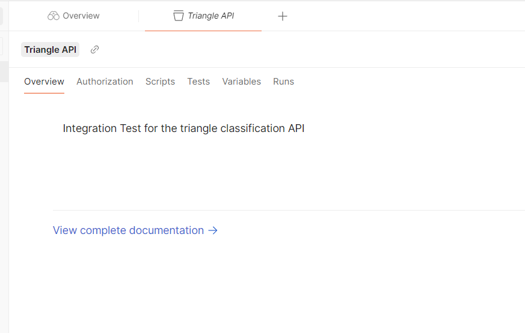

**Environment variable:**

```
{{url}} = http://127.0.0.1:5000
```

This allows requests to be reused easily.

#### Collection Requests

All requests defined in `TriangleAPI.postman_collections.json`:

| # | Name | Method | URL |
|---|------|--------|-----|
| 1 | Get All Triangles | GET | `{{url}}/triangles` |
| 2 | Get Triangle by ID | GET | `{{url}}/triangles/1` |
| 3 | Get Triangle by Invalid ID | GET | `{{url}}/triangles/999` |
| 4 | Create Valid Triangle – Scalene | POST | `{{url}}/triangles` |
| 5 | Create Valid Triangle – Equilateral | POST | `{{url}}/triangles` |
| 6 | Create Valid Triangle – Isosceles | POST | `{{url}}/triangles` |
| 7 | Create Invalid Triangle – Zero Side | POST | `{{url}}/triangles` |
| 8 | Create Invalid Triangle – Negative Side | POST | `{{url}}/triangles` |
| 9 | Create Invalid Triangle – Not a Triangle | POST | `{{url}}/triangles` |
| 10 | Create Invalid Triangle – Missing Value | POST | `{{url}}/triangles` |

### Example Requests Tested

#### GET Request – List All Triangles

```
GET {{url}}/triangles
```

Example response:

```json
[
  {
    "a": 3,
    "b": 4,
    "c": 5,
    "id": 1,
    "triangle_type": "Scalene"
  }
]
```

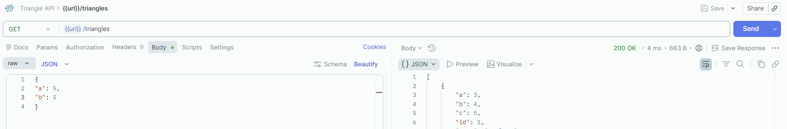

#### POST Request – Valid Triangle

```
POST {{url}}/triangles
```

Body:

```json
{
  "a": 3,
  "b": 4,
  "c": 5
}
```

Response:

```json
{
  "message": "Triangle created",
  "item": {
    "id": 1,
    "a": 3,
    "b": 4,
    "c": 5,
    "triangle_type": "Scalene"
  }
}
```

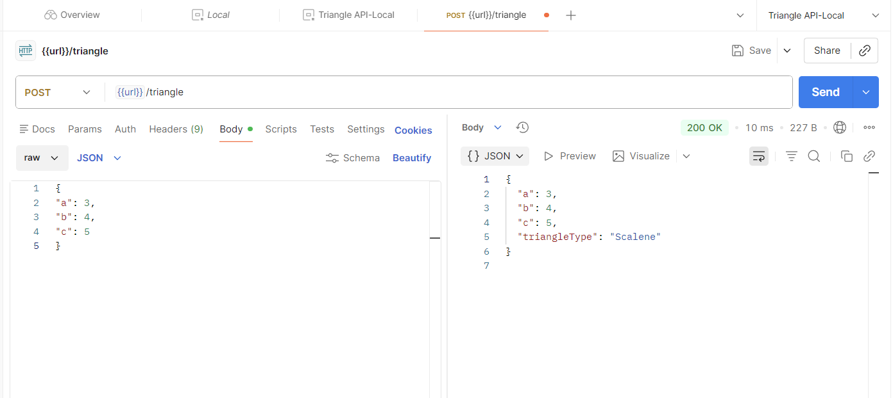

#### POST Request – Equilateral Triangle

Body:

```json
{
  "a": 5,
  "b": 5,
  "c": 5
}
```

Response:

```json
{
  "triangle_type": "Equilateral"
}
```

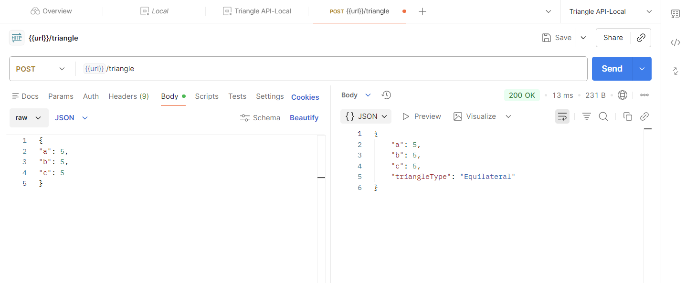

#### Error Scenario – Missing Parameter

Body:

```json
{
  "a": 5,
  "b": 5
}
```

Response:

```json
{
  "error": "Missing triangle sides",
  "status": 400
}
```

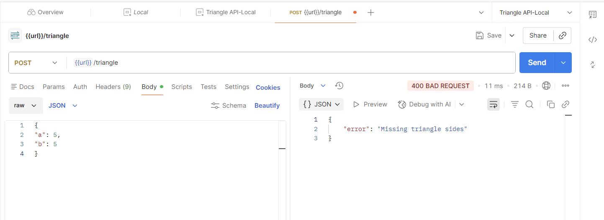

### Persistence Behavior

The Triangle API stores triangle records in memory using a simulated data layer.

After executing:

```
POST /triangles
```

Records remain available when calling:

```
GET /triangles
```

This demonstrates persistence during runtime execution of the application.

### Additional Requests Created

Additional integration tests performed:

| Endpoint | Method |
|----------|--------|
| `/health` | GET |
| `/triangles` | GET |
| `/triangles` | POST |
| `/triangles/{id}` | GET |
| `/triangles/{id}` | PUT |
| `/triangles/{id}` | DELETE |
| `/triangles/summary` | GET |

These requests validated API functionality and error handling behavior.

#### GET /health

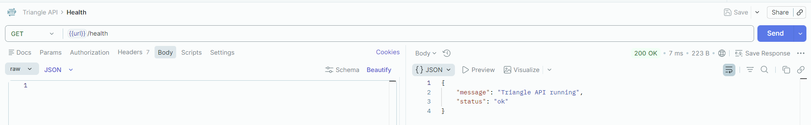

#### GET /triangles/{id}

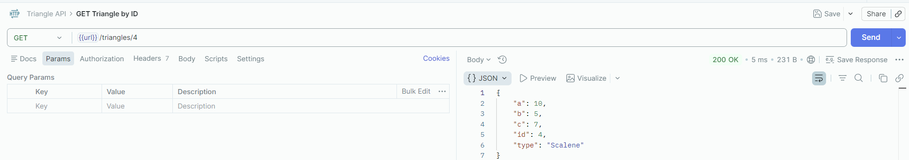

#### GET /triangles/{id} – Scalene Result

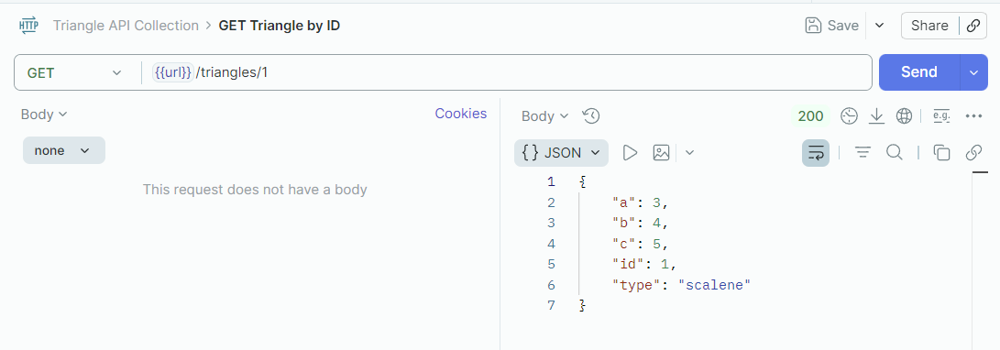

#### DELETE /triangles/{id}

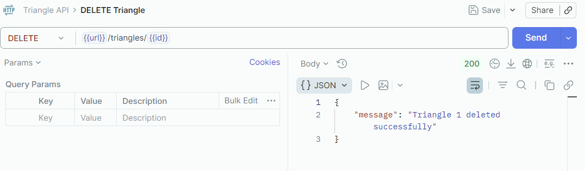

#### POST – Isosceles Triangle

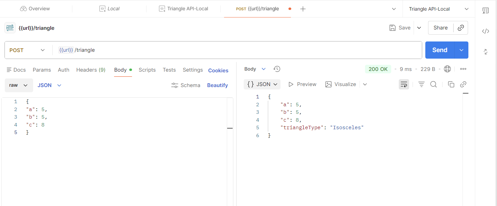

#### POST – Invalid Triangle (sides violate triangle inequality)

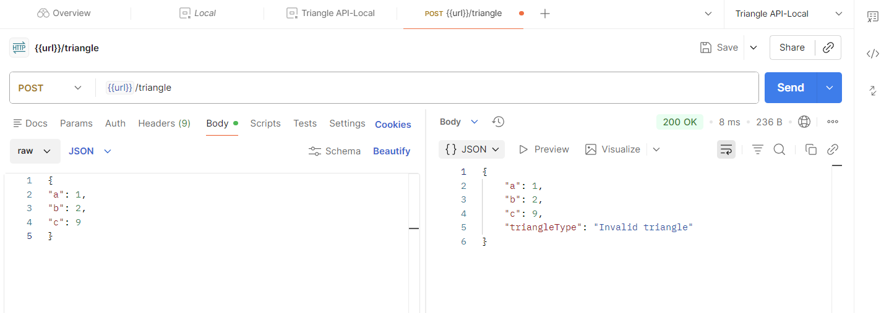

#### POST – Not a Valid Triangle (400 error)

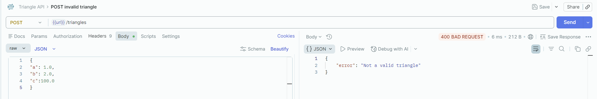

#### GET /triangles/{id} – 404 Not Found

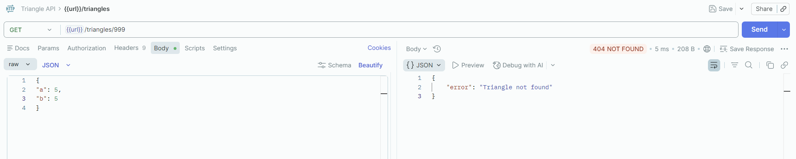

---

## Extra Credit – curl Requests

Example GET request:

```bash
curl http://127.0.0.1:5000/triangles
```

Example POST request:

```bash
curl -X POST http://127.0.0.1:5000/triangles \
  -H "Content-Type: application/json" \
  -d '{"a":3,"b":4,"c":5}'
```

### Advantages of curl

- Works in terminal environments
- Useful for automation scripts
- Lightweight compared to GUI tools

### Advantages of Postman

- Visual interface
- Collections
- Environment variables
- Structured request testing

---

## Conclusion and Recommendations

This lab demonstrated how integration testing verifies communication between clients and APIs using HTTP requests. Postman collections and environment variables improved request organization and testing efficiency.

Testing confirmed that the Triangle API correctly classified triangle types, handled invalid input scenarios, and stored triangle records during runtime. Integration testing tools such as Postman are essential for validating distributed system reliability.
