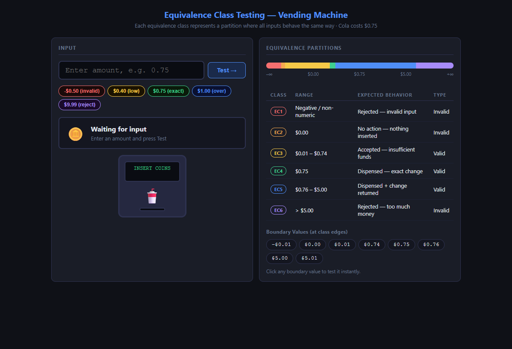
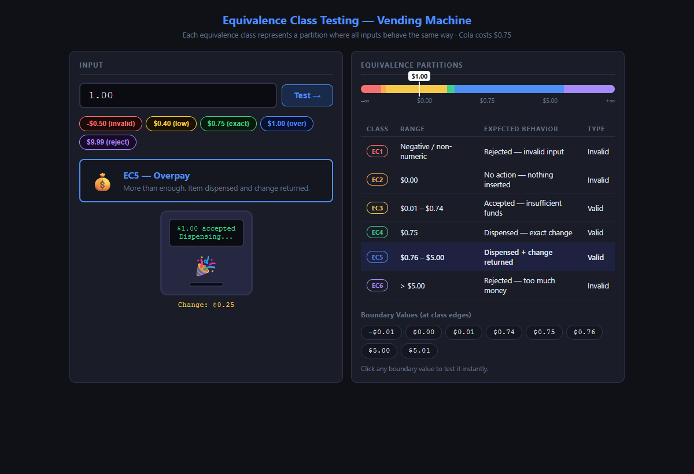
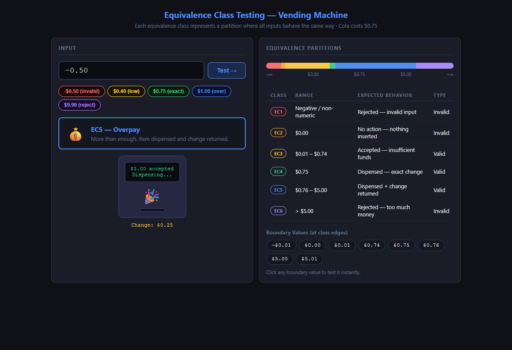
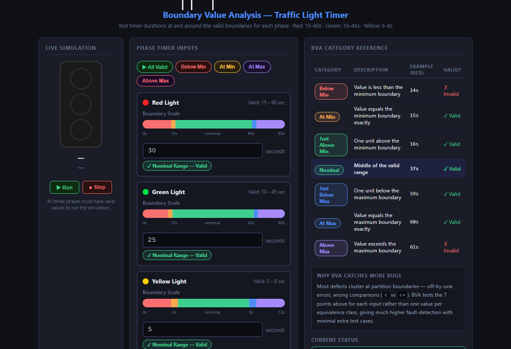
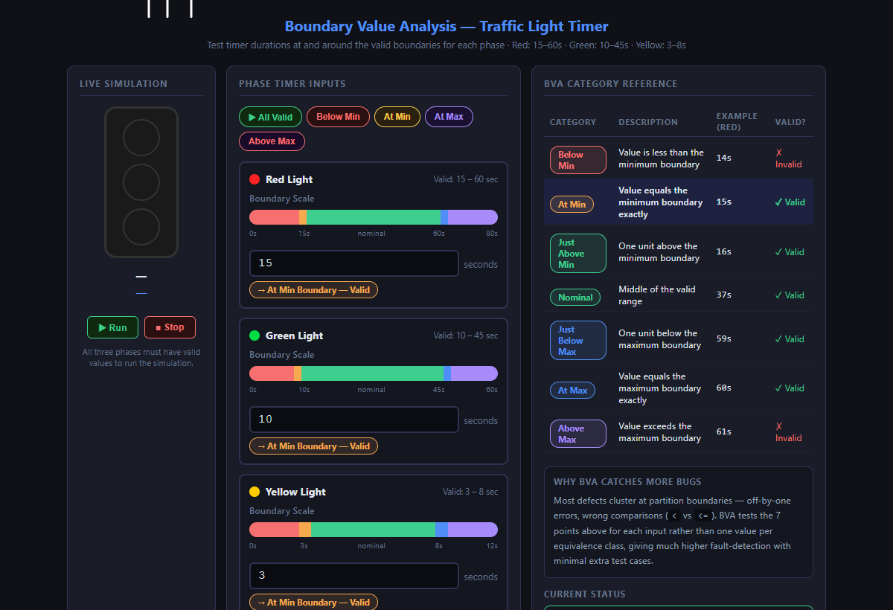
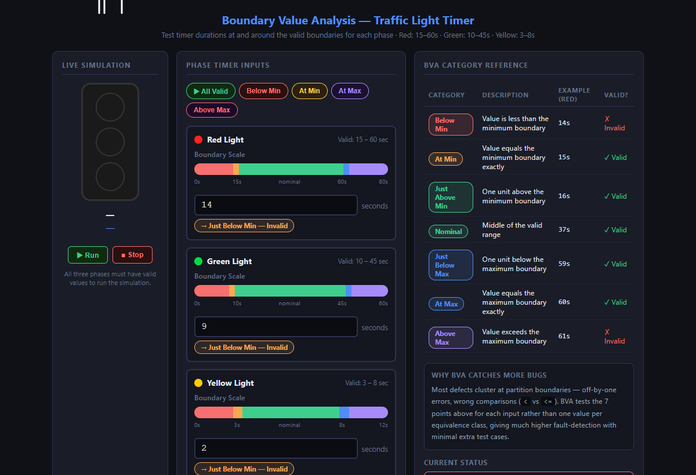
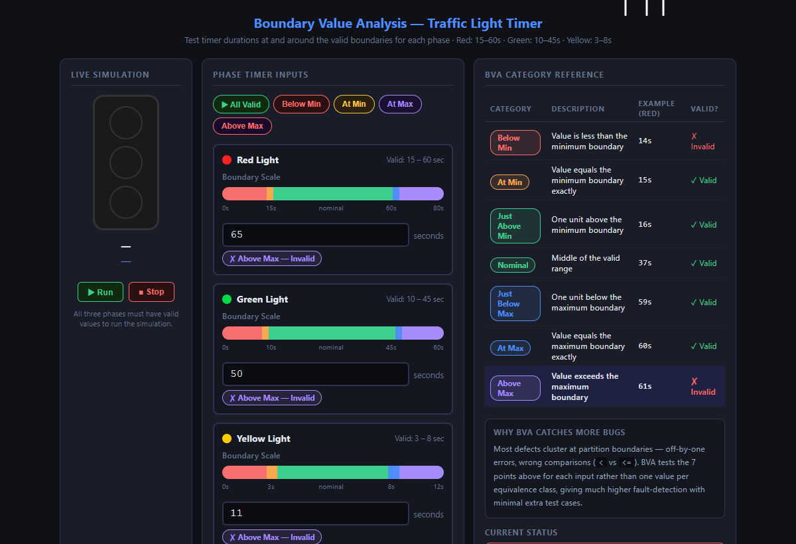

# Week 3 — Equivalence Classes & Boundary Value Analysis

---

## Introduction

### Equivalence Class Testing

Equivalence class testing (also called equivalence partitioning) is a **black-box** technique that divides the input domain of a system into groups — *partitions* — where every value in a partition is expected to produce the same behavior. The core insight is that if one value in a partition causes a failure, all values in that partition should cause the same failure. Conversely, if one value works correctly, testing additional values from the same partition adds no new information.

**Partitions come in two flavors:**

| Type | Description | Example (Vending Machine, price = $0.75) |
|------|-------------|------------------------------------------|
| **Valid** | Inputs the system should accept and handle correctly | $0.40 (insufficient), $0.75 (exact), $1.00 (overpay) |
| **Invalid** | Inputs the system should reject with an error | –$0.50 (negative), $9.99 (too large) |

For the vending machine there are **6 equivalence classes** covering the full input domain:

| Class | Range | Expected Behavior |
|-------|-------|-------------------|
| EC1 | Negative / non-numeric | Rejected — invalid input |
| EC2 | $0.00 | No action — nothing inserted |
| EC3 | $0.01 – $0.74 | Coins accepted, insufficient funds |
| EC4 | $0.75 | Item dispensed, no change |
| EC5 | $0.76 – $5.00 | Item dispensed + change returned |
| EC6 | > $5.00 | Rejected — too much money |

The minimum number of test cases to achieve full equivalence class coverage is **one representative value per class** — six tests total instead of testing every possible dollar amount.

**When to use it:** Any time the input domain is large or continuous (dollar amounts, ages, temperatures, string lengths, HTTP status codes). Also effective when the specification defines clearly distinct behaviors for different input ranges.

**Limitations:**
- Choosing the wrong partition boundaries is the most common mistake — if the spec is ambiguous, the partitions will be wrong.
- Does not detect errors *at* partition edges (see Boundary Value Analysis below).
- Assumes all values within a partition truly behave the same; complex logic can hide sub-partitions the tester misses.
- Does not address combinations of multiple inputs (see Pairwise Testing, Week 5).

---

### Boundary Value Analysis (BVA)

Boundary Value Analysis complements equivalence partitioning by targeting the **edges** of each partition. Studies show that defects cluster at boundaries — off-by-one errors (`<` vs `<=`), fence-post bugs, and incorrect range checks all appear at the transition point between partitions.

For each boundary between two partitions, BVA specifies **up to 7 test points**:

| BVA Point | Description | Example (Red light, valid = 15–60s) |
|-----------|-------------|--------------------------------------|
| Below Min | Just outside the lower boundary | 14s |
| At Min | Exactly at the lower boundary | 15s |
| Just Above Min | One unit inside the lower boundary | 16s |
| Nominal | Middle of the valid range | 37s |
| Just Below Max | One unit inside the upper boundary | 59s |
| At Max | Exactly at the upper boundary | 60s |
| Above Max | Just outside the upper boundary | 61s |

**When to use it:** Whenever equivalence partitioning identifies a numeric or ordered range. BVA is almost always applied alongside equivalence partitioning — together they give strong coverage with a small number of test cases.

**Limitations:**
- Only applies to ordered, comparable inputs. It cannot be applied directly to unordered sets (e.g., a dropdown of country names).
- Does not cover interactions between multiple input variables — a value that is individually valid may fail when combined with another input.
- The "one unit" step size assumes discrete input; for floating-point inputs the definition of "just above" requires careful thought.

---

## Vibe Coding Assignment

Two interactive single-file HTML apps were built using Claude Code (Anthropic's agentic CLI). Both run directly in a browser with no build step.

---

### App 1 — Vending Machine (Equivalence Classes)

**File:** `vending-machine-eq.html`

The vending machine sells Cola for $0.75. The user enters any amount (or clicks a preset) and the app classifies the input into one of the six equivalence classes, lights up the matching row in the partition table, moves a pointer along the number line, and animates the machine.

#### Screenshot — App Overview



---

#### Sunny Day Scenario — EC5: Overpay ($1.00)

The user enters $1.00. The app recognizes this falls in EC5 (valid overpay range $0.76–$5.00). The machine dispenses Cola and returns $0.25 change.



---

#### Rainy Day Scenario 1 — EC3: Insufficient Funds ($0.40)

The user enters $0.40. EC3 is highlighted. The machine displays "Need $0.35 more" and holds the coins without dispensing.


---

#### Rainy Day Scenario 2 — EC1: Invalid Input (–$0.50)

The user enters a negative number. EC1 fires. The machine rejects the input immediately without updating the balance.



---

#### Rainy Day Scenario 3 — EC6: Rejected ($9.99)

The user enters $9.99, which exceeds the $5.00 machine limit. EC6 fires and all coins are returned.


---

#### Key Code Snippet — Classification Logic

The heart of the app is a single `classify()` function that maps any input to an equivalence class number. Notice that only the **class boundaries** appear in code — each `if` branch represents one partition:

```js
const PRICE = 0.75;
const MAX   = 5.00;

function classify(raw) {
  if (raw.trim() === '') return null;
  const n = parseFloat(raw);
  if (isNaN(n) || n < 0)              return 1;  // EC1 — invalid
  if (n === 0)                         return 2;  // EC2 — zero
  if (n > 0 && n < PRICE)             return 3;  // EC3 — insufficient
  if (Math.abs(n - PRICE) < 0.001)    return 4;  // EC4 — exact
  if (n > PRICE && n <= MAX)          return 5;  // EC5 — overpay
  return 6;                                       // EC6 — too much
}
```

Each branch is exactly one test case in the equivalence class test suite. If `classify()` returns the wrong class for any representative value, the entire partition is suspect.

---

### App 2 — Traffic Light Timer (Boundary Value Analysis)

**File:** `traffic-light-bva.html`

The traffic light has three phases with defined valid timer ranges:

| Phase | Valid Range |
|-------|-------------|
| Red   | 15 – 60 seconds |
| Green | 10 – 45 seconds |
| Yellow | 3 – 8 seconds |

The user enters a duration for each phase. For each input the app:
- Categorizes the value into one of the 7 BVA points
- Shows a live pointer on a boundary scale
- Highlights the matching row in the BVA reference table
- Shows a badge (e.g. "At Min Boundary — Valid" or "✗ Above Max — Invalid")

When all three phases are valid, the **Run** button starts the animated traffic light cycling through the actual durations entered.

#### Screenshot — App Overview


---

#### Sunny Day Scenario — All Nominal Values

Red = 30s, Green = 25s, Yellow = 5s. All three values fall in the nominal (middle) range of their partitions. All badges show green. The light animates correctly.



---

#### Rainy Day Scenario 1 — At Min Boundary

Red = 15s, Green = 10s, Yellow = 3s. Each value sits exactly on the minimum boundary. The app flags each as "At Min Boundary — Valid" in orange. The simulation still runs because min is inclusive — this is the boundary test that checks the `>=` vs `>` decision in code.



---

#### Rainy Day Scenario 2 — Below Min (one unit)

Red = 14s, Green = 9s, Yellow = 2s. Each is one unit below the minimum. Badges switch to red "✗ Below Min — Invalid" and the Run button is blocked. This is the critical BVA test that catches an off-by-one `>` instead of `>=`.



---

#### Rainy Day Scenario 3 — Above Max

Red = 65s, Green = 50s, Yellow = 11s. All values exceed their maximum. Badges show purple "✗ Above Max — Invalid". The overall status panel displays which phases are invalid.



---

#### Key Code Snippet — BVA Categorization

The `categorize()` function maps a numeric value to its BVA point. The key insight is that both `min` and `max` are explicitly checked **before** the nominal range — this directly mirrors what BVA tests in the underlying implementation:

```js
function categorize(val, min, max) {
  if (val < min - 1)   return 'below';           // Below Min
  if (val === min)     return 'atmin';            // At Min  ← boundary
  if (val === min + 1) return 'just-above-min';   // Just Above Min
  if (val > min + 1 && val < max - 1) return 'nominal';
  if (val === max - 1) return 'just-below-max';   // Just Below Max
  if (val === max)     return 'atmax';            // At Max  ← boundary
  return 'above';                                 // Above Max
}
```

The validation check that the traffic light simulation uses is equally simple:

```js
function isValid(val, min, max) {
  return val >= min && val <= max;
}
```

The BVA test suite exists precisely to verify that `>=` and `<=` (not `>` and `<`) appear in this function. The "at min" and "at max" test cases would fail if someone accidentally wrote `> min` or `< max`.

---

## Conclusion

### Problems Encountered

- **Floating-point comparison for EC4:** The "exact change" class ($0.75) cannot be checked with `n === 0.75` in JavaScript due to floating-point precision. A small epsilon comparison (`Math.abs(n - PRICE) < 0.001`) was needed — a real-world reminder that numeric boundaries in code are not always as clean as they appear in a spec.
- **Traffic light scale visualization:** Mapping the raw second value onto a percentage position for the boundary scale pointer required defining a separate display range per phase (e.g., 0–80s for Red). Values outside this display range had to be clamped to avoid the pointer disappearing off-screen while still correctly showing an invalid badge.
- **BVA "just above/below" for non-integer inputs:** BVA assumes a discrete "one unit" step. For the vending machine app (dollar amounts), the minimum meaningful step is $0.01, which needed to be accounted for when deciding what "just above $0.75" means.

### What I Learned About AI Tools
a
Claude Code generated both complete, working apps in a single pass from a plain English description. The most useful aspect was that the AI understood the *testing concepts* well enough to structure the code around them — the `classify()` function in the vending machine app has exactly one branch per equivalence class, not an arbitrary series of nested conditions. This made the connection between the test technique and the implementation immediately visible, which is the whole point of the assignment.

The preset scenario buttons ("At Min", "Below Min", etc.) were suggested by the AI rather than explicitly requested. This kind of proactive feature addition made the apps much more useful for live demonstration — clicking one button to load a specific BVA scenario is far better than manually typing boundary values during a presentation.

One limitation observed: the AI does not take screenshots autonomously, so placeholder image references had to be filled in manually after running the apps in a browser. For a fully automated assignment pipeline this would need a headless browser tool like Playwright.
